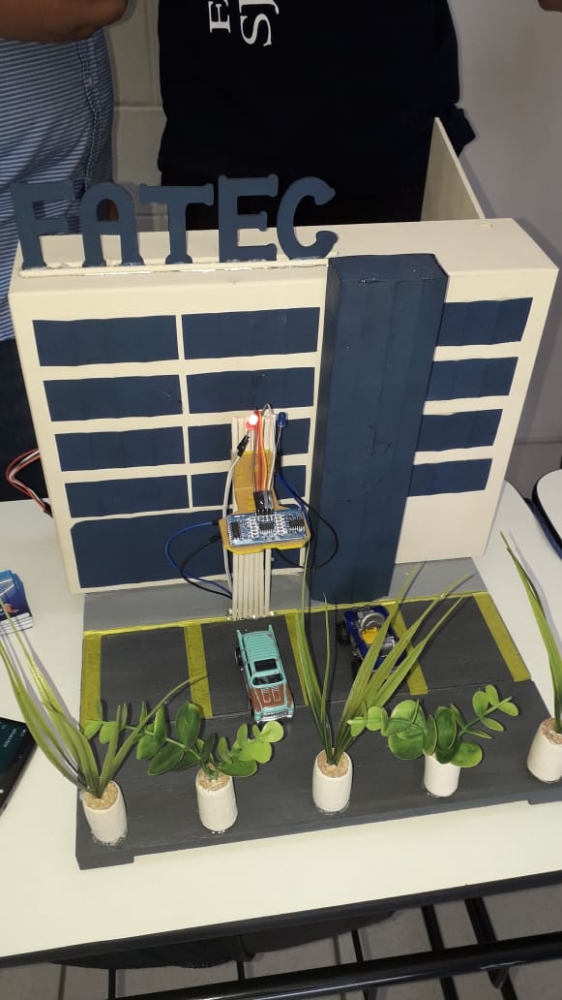

## Introdução

Minha paixão pela programação começou no ensino médio e se intensificou durante o curso técnico em TI, concluído em 2017. 

A experiência prática de desenvolver projetos e a descoberta das diversas possibilidades da área me impulsionaram a buscar uma formação mais aprofundada. 

Foi assim que, em 2019, ingressei no curso de Análise e Desenvolvimento de Sistemas na FATEC, com o objetivo de aprimorar minhas habilidades e construir uma carreira sólida na área.

Nessa jornada na área criei gosto por analisar e solucionar problemas, tanto que hoje tenho como passatempo a área de manutenção de placas eletrônicas.

Este portfólio tem o objetivo de destacar os diversos projetos desenvolvidos ao longo dos semestres durante o curso de Análise e Desenvolvimento de Sistemas na FATEC SJC.

Não possuo experiência profissional formal, mas estou ansioso para iniciar minha carreira.

 

## Contato

   

   

## Conhecimentos

 
 

## Projetos

## Projeto 1 - 2019-2

**Parceiro acadêmico:** Professores Antonio Egydio e Jean Carlos da [Fatec São José dos Campos - Prof. Jessen Vidal](https://fatecsjc-prd.azurewebsites.net/)

Os grandes estacionamentos enfrentam o desafio de baixa eficiência na busca por vagas, gerando frustração para motoristas e aumentando o tráfego dentro dos estacionamentos. O problema central era a falta de uma forma prática de visualizar as vagas disponíveis em tempo real.

O Smartparking surge como uma solução tecnológica baseada em IoT (Internet das Coisas) para resolver essa deficiência. Ele auxilia motoristas a encontrar vagas de maneira simples e rápida. Utilizando sensores ultrassônicos conectados a uma placa Arduino, o sistema transmite informações em tempo real sobre as vagas disponíveis para um aplicativo, otimizando o processo de estacionamento e reduzindo a circulação desnecessária.

## Tecnologias Utilizadas

Para desenvolver o projeto Smartparking, utilizamos uma combinação de tecnologias de hardware, software e banco de dados. As principais tecnologias incluíram:

- **Arduino Uno:** Usado como o cérebro do projeto, o Arduino contava as vagas do estacionamento usando o sensor ultrassônico para detectar veículos. Ele também enviava dados via Bluetooth para o aplicativo Android.

- **Sensor ultrassônico:** Escolhido por sua capacidade de medir a distância a objetos, o sensor ultrassônico facilitou a detecção de veículos estacionados.

- **Módulo Bluetooth:** Utilizado para a comunicação entre o Arduino e o aplicativo móvel devido à sua fácil integração.

- **AppInventor:** Plataforma online para desenvolvimento de aplicativos por meio de programação em blocos. Criamos dois aplicativos: um principal para os usuários verificarem as vagas disponíveis e outro para gerar métricas a partir da opinião dos usuários sobre o protótipo.

- **Firebase:** Usado para armazenar dados de usuários cadastrados e métricas geradas. O Firebase foi escolhido pela sua simplicidade e por ser um banco de dados NoSQL.

- **C++:** Linguagem de programação utilizada para escrever o código do Arduino e suas integrações.

## Contribuições Pessoais

Minhas contribuições incluíram a programação do Arduino, integração com o sensor ultrassônico e o aplicativo Android usando Bluetooth. Além disso, trabalhei no desenvolvimento do aplicativo Core e integrações com o Firebase usando AppInventor.

### Hard Skills

- Programação de placas Arduino e NodeMcu
> Sei fazer com autonomia
- Integrações Bluetooth
> Sei fazer com autonomia
- Integrações Firebase
> Sei fazer com autonomia
- Desenvolvimento em blocos com AppInventor
> Sei fazer com autonomia

### Soft Skills

- Adaptabilidade 
> Diante do desafio de trabalhar com tecnologias como Arduino e App Inventor, que eram novidade para todos os membros da equipe, demonstrei grande capacidade de adaptação, rapidamente assimilando novos conceitos e aplicando-os na prática. Essa flexibilidade foi fundamental para superar os obstáculos e entregar o projeto com sucesso.
- Trabalho em equipe
> Embora não houvesse um líder formal na equipe, contribuí ativamente para um ambiente colaborativo, compartilhando meus conhecimentos e aprendizados com os demais membros. A troca de ideias e a colaboração mútua foram essenciais para o desenvolvimento do projeto.
- Comunicação
> Ao apresentar o projeto para a turma e para o professor, aprimorei minhas habilidades de comunicação, explicando de forma clara e concisa as soluções técnicas adotadas e os resultados obtidos.
#

## Projeto 2 - 2020-1

**Parceiro acadêmico:** [SPC Brasil](https://www.spcbrasil.org.br/)

**Projeto:** [MetaApp](https://github.com/ThallesTorres/Projeto_SPC)

#### Visão do Projeto

  
Com a transição para o novo modelo de operação do Cadastro Positivo, o SPC Brasil enfrentava um problema crítico: a dificuldade em gerenciar e garantir a qualidade de grandes volumes de dados em arquivos .csv. Esse desafio impactava diretamente a confiabilidade dos relatórios e a capacidade de extrair insights valiosos.

O MetaApp foi desenvolvido para atender a essa necessidade, oferecendo uma solução eficiente e intuitiva. Ele extrai dados de arquivos .csv e gera relatórios com indicadores de qualidade especificados pelo cliente. Além disso, permite o armazenamento local por meio de um executável, simplificando a operação e promovendo a qualidade na gestão de informações.

#### Requisitos Funcionais (com base nos indicadores de qualidade do cliente)
- Integridade 
- Recência
- Confidencialidade
- Confiabilidade
- Completude
- Consistência

#### Requisitos Não Funcionais
- Disponibilizar uma aplicação desktop
- Análise e tratamento de arquivos .xlsx e .csv

**Visualização do relatório:**

## Tecnologias Utilizadas

- **HTML e CSS**: Utilizados no desenvolvimento da interface gráfica para o usuário.

- **Python**: Utilizado no back-end do projeto, sendo responsável pelo processo que os dados contidos nos documentos .csv eram submetidos: leitura, validação, correção e armazenamento.

- **Jupyter Notebook**: Utilizado com a finalidade de tornar o desenvolvimento mais dinâmico, facilitando a visualização e compartilhamento do código do projeto.

## Contribuições Pessoais

Fui encarregado de desenvolver tanto o front-end do projeto, utilizando HTML e CSS para criar uma interface amigável para o usuário, quanto de analisar os dados recebidos pelo back-end. A minha responsabilidade era garantir que as informações fossem apresentadas de forma simples, com uma legenda clara, e que os resultados processados pelo back-end fossem exibidos através de gráficos e porcentagens de maneira compreensível para o usuário.

### Hard Skills

- **HTML e CSS**: Utilizados no desenvolvimento da interface gráfica para o usuário.
> Sei fazer com autonomia
- **Python**: Utilizado no back-end do projeto para leitura, validação, correção e armazenamento de dados.
> Sei fazer com autonomia

### Soft Skills

- Proatividade 
> Demonstrando proatividade, iniciei estudos independentes em programação, o que me permitiu contribuir de forma mais efetiva para o desenvolvimento do back-end do projeto. Essa iniciativa foi fundamental para superar os desafios da manipulação de dados e garantir a entrega de um produto de qualidade.
- Resolução de problemas
> Ao lidar com a complexidade da manipulação de dados em grande escala, desenvolvi habilidades de resolução de problemas, buscando soluções eficientes para garantir a qualidade dos resultados. 
#

## Projeto 3 - 2020-2

**Parceiro acadêmico:** [Visiona Tecnologia Espacial S.A.](https://www.visionaespacial.com.br/)

**Projeto:** [JumboETL](https://github.com/DaviNeves0/ETL_Visiona)

#### Visão do Projeto

  
A Visiona enfrentava o desafio de manipular grandes volumes de dados georreferenciados de maneira prática e eficiente. A ausência de uma ferramenta específica dificultava o processo de extração, armazenamento e transformação desses dados, aumentando a complexidade e o tempo gasto.

O JumboETL foi desenvolvido como uma aplicação web para resolver esse problema, simulando um processo ETL (Extract, Transform, Load). Ele permite a extração de dados de arquivos shapefile, seu armazenamento em um banco de dados e o processo inverso, com uma interface simples e acessível via navegador. O sistema facilita tanto o upload quanto a criação de novos arquivos shapefile com base nos dados processados.

#### Requisitos Funcionais
 - Carga de dados geográficos (ponto, linha e polígono) e seus atributos alfanuméricos em tabelas existentes de banco de dados geográficos;
 - Recuperação de dados geográficos (ponto, linha e polígono) e seus atributos alfanuméricos armazenados em banco de dados geográficos.

#### Requisitos Não Funcionais
 - Ser um sistema Web;
 - Linguagens Python ou Java;
 - Banco de Dados Geográficos PostGIS.

**Telas do sistema JumboETL:**

## Tecnologias Utilizadas

- HTML/CSS - para estruturação da página Web
- Bibliotecas React, Axios, Ant Design, React Suite - para o Front-end
- PostgreSQL e extensão PostGIS - para armazenar os dados georreferenciados
- Java, Maven, Sprint, Tomcat - para estrutura do Back-end.
- Geotools e Gdal - para trabalhar com os dados geoespaciais

## Contribuições Pessoais

No projeto, atuei no front-end com HTML/CSS e bibliotecas como React, Axios, Ant Design e React Suite. No back-end, utilizei Java, Maven, Spring e Tomcat, integrando o PostgreSQL com PostGIS para armazenar dados georreferenciados. Também utilizei Geotools e Gdal para manipulação de dados geoespaciais, contribuindo assim para o desenvolvimento completo e funcional do sistema JumboETL.

### Hard Skills

- **HTML e CSS**
> Sei utilizar com autonomia
- **Java**
> Sei utilizar com autonomia
- **PostgreSQL**
> Sei utilizar com autonomia
- **Geotools e Gdal**
> Sei utilizar com autonomia

### Soft Skills

- Perseverança 
> Diante dos desafios apresentados pelo projeto, como a complexidade da linguagem Java e a manipulação de dados geográficos, demonstrei perseverança e determinação para superar os obstáculos e entregar um produto completo e funcional.
- Resolução de problemas
> Ao lidar com a complexidade da integração de diferentes tecnologias e da manipulação de dados geográficos, desenvolvi habilidades de resolução de problemas, buscando soluções criativas e eficientes para os desafios encontrados. A capacidade de analisar o problema de forma sistemática e identificar a causa raiz foi fundamental para o sucesso do projeto.

#

## Projeto 4 - 2023-2

**Parceiro acadêmico:** [GREENNEAT](https://greenneat.eco.br/)

**Projeto:** [Quantum Team](https://github.com/QuantumTeam23/API--4-ADS)

#### Visão do Projeto

  
O descarte inadequado de óleo de fritura usado é um problema ambiental significativo, agravado pela falta de uma plataforma eficaz para gerenciar o processo de coleta e reciclagem. A Greenneat enfrentava dificuldades em rastrear e recompensar os estabelecimentos participantes da cadeia de descarte.

O projeto Quantum Team propôs uma solução integrada para resolver esse problema, criando uma plataforma que gerencia créditos de parceiros cadastrados. Esses créditos podem ser utilizados na loja virtual, incentivando práticas ambientalmente responsáveis e promovendo a economia circular. O sistema conecta estabelecimentos fornecedores e parceiros coletores, simplificando o processo de coleta e reciclagem.

#### Requisitos Funcionais
 - Implementação de formulário para cadastro de parceiros Greenneat.
 - Desenvolvimento de formulário para cadastro de estabelecimentos onde o óleo será coletado.
 - Criação de um sistema de transação de créditos Greenneat.
 - Desenvolvimento de painéis específicos para usuários parceiros, estabelecimentos e administração.
 - Criação de um dashboard com rankings.
 - Implementação de um comparador de preços entre óleo virgem, óleo usado e créditos Greenneat.

#### Requisitos Não Funcionais
- Garantia de bom tempo de resposta e execução eficiente nas transações.
- Interface amigável, com boa usabilidade para todos os tipos de usuários.
- Inclusão de métricas para monitorar e analisar o desempenho e comportamento do sistema.

**Projeto finalizado**

## Tecnologias Utilizadas

- Front-end: React
- Back-end: Node.js
- Linguagem de Programação: TypeScript
- Banco de Dados: PostgreSQL
- Ferramentas: Git, GitHub, Visual Studio Code, Figma, Canva

## Contribuições Pessoais

No projeto, desempenhei um papel fundamental no desenvolvimento do front-end utilizando React, uma biblioteca JavaScript amplamente reconhecida pela sua eficiência e versatilidade na criação de interfaces web dinâmicas. Utilizando também TypeScript, pude garantir uma maior segurança e consistência no código, facilitando a manutenção e a escalabilidade do sistema.

Além disso, trabalhei na integração de ferramentas como Figma e Canva para a criação de designs e layouts visualmente atraentes e funcionais. Utilizando o Visual Studio Code como ambiente de desenvolvimento e o Git/GitHub para controle de versão e colaboração, contribuí para garantir a qualidade e a eficiência do projeto do início ao fim.

### Hard Skills

- React
> Sei utilizar com autonomia
- Node.js
> Sei utilizar com ajuda
- TypeScript
> Sei utilizar com autonomia
- PostgreSQL
> Sei utilizar com ajuda

### Soft Skills

- Resiliência
> Após uma pausa de dois anos e meio, retornei aos estudos com determinação, superando os desafios de retomar a programação e me adaptar a novas tecnologias. Essa experiência fortaleceu minha resiliência e capacidade de lidar com situações adversas.
- Adaptabilidade
> Aprender TypeScript e suas tecnologias, além de me integrar a uma nova equipe, exigiu que eu fosse flexível e capaz de aprender rapidamente. Essa adaptabilidade me permitiu contribuir ativamente para o sucesso do projeto, mesmo em um ambiente novo e desafiador.
- Trabalho em equipe
> A experiência de trabalhar em uma equipe nova e acolhedora me permitiu desenvolver minhas habilidades de colaboração e comunicação. A troca de ideias e o apoio mútuo foram fundamentais para o sucesso do projeto.
#

## Projeto 5 - 2024-1

**Parceiro acadêmico:** [Oracle](https://www.oracle.com/br/partnernetwork/expertise/)

**Projeto:** [New Tech](https://github.com/NewTechh/API-5-ADS)

#### Visão do Projeto

  
A Oracle identificou dificuldades no gerenciamento de seus parceiros, incluindo o cadastro, monitoramento do desenvolvimento de expertise e controle das trilhas de conhecimento. A ausência de um sistema integrado gerava ineficiências operacionais e falta de visibilidade sobre o progresso dos parceiros.

O New Tech foi desenvolvido para solucionar esse problema, criando um sistema de gestão de parceiros para dispositivos móveis. A aplicação permite o cadastro de novos parceiros, gerenciamento de atualizações, acompanhamento do desenvolvimento de conhecimento e geração de relatórios. Com diferentes níveis de acesso, o sistema oferece funcionalidades robustas e promove uma gestão mais eficiente e centralizada.

#### Requisitos Funcionais
 - Autenticação de usuários.
 - Cadastro de consultores de alianças.
 - Visualização de usuários.
 - Monitoramento do desempenho dos parceiros por trilhas de conhecimento (Tracks).
 - Interface personalizada para administradores.
 - Interface personalizada para consultores de alianças.

#### Requisitos Não Funcionais
- Segurança: Implementação de mecanismos robustos de segurança para proteger os dados dos usuários e parceiros.
- Manutenibilidade: O código deve ser escrito de forma clara e modular para facilitar futuras manutenções e atualizações.
- Documentação: Manter uma documentação abrangente e atualizada para desenvolvedores e usuários finais.

**Projeto finalizado**

## Tecnologias Utilizadas

- Front-end: React Native
- Back-end: Node.js
- Linguagem de Programação: TypeScript
- Banco de Dados: PostgreSQL, MongoDB
- Ferramentas: Git, GitHub, Visual Studio Code, Figma, Canva

## Contribuições Pessoais

No projeto, concentrei meus esforços principalmente no desenvolvimento do front-end usando React Native e TypeScript. Isso resultou na criação de interfaces móveis dinâmicas e seguras, incluindo telas como login, cadastro de parceiros e consultores de alianças, além de um dashboard para monitorar o desempenho dos parceiros.
Além disso, participei do desenvolvimento do back-end com Node.js e TypeScript, implementando funcionalidades cruciais, como autenticação de usuários e gerenciamento de dados.

### Hard Skills

- React Native
> Sei utilizar com autonomia
- Node.js
> Sei utilizar com autonomia
- TypeScript
> Sei utilizar com autonomia
- PostgreSQL
> Sei utilizar com autonomia
- MongoDB
> Sei utilizar com ajuda

### Soft Skills

- Aprendizagem rápida 
> A experiência com React Native me proporcionou a oportunidade de aprimorar minhas habilidades de aprendizado rápido, adaptando-me rapidamente a novas tecnologias e frameworks, o que é fundamental em um mercado em constante evolução.
- Resolução de problemas
> Ao enfrentar desafios como a otimização do desempenho e a compatibilidade com diferentes dispositivos, desenvolvi habilidades de resolução de problemas, buscando soluções criativas e eficientes para garantir a qualidade do aplicativo.

## Projeto 6 - 2024-2

**Parceiro acadêmico:** [Dom Rock](https://www.domrock.net/)

**Projeto:** [By Tech](https://github.com/CamilaRedondo/API-FATEC-6-SEM)

#### Visão do Projeto

  
O setor de marketing enfrenta desafios significativos na gestão e análise de grandes volumes de dados de clientes. A dispersão de informações em diversas plataformas, a dificuldade em identificar padrões e tendências relevantes e a falta de ferramentas adequadas para personalizar campanhas são obstáculos que impedem a otimização das estratégias de marketing e a tomada de decisões mais assertivas. A análise manual de dados é um processo lento e propenso a erros, limitando a capacidade das empresas em extrair insights valiosos para o negócio.

Para superar esses desafios, estabelecemos uma parceria com a Dom Rock, empresa especializada em inteligência artificial, visando o desenvolvimento de um chatbot customizado para o setor de marketing. Essa solução inovadora tem como objetivo otimizar a análise de dados, personalizar campanhas e identificar oportunidades de crescimento. Através da arquitetura RAG, o chatbot acessa dados vetorizados, o que garante respostas mais precisas e relevantes. Com essa ferramenta, as empresas poderão tomar decisões mais estratégicas, baseadas em dados concretos e análises precisas, impulsionando o crescimento e a eficácia de suas ações de marketing.

#### Requisitos Funcionais

#### Requisitos Não Funcionais

**Projeto finalizado**

## Tecnologias Utilizadas

## Contribuições Pessoais

### Hard Skills

### Soft Skills

